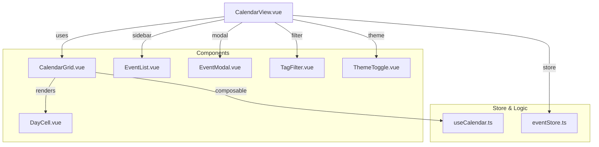

<div align="center">
  <a href="https://github.com/tyronejosee/project_prototype_vuejs#gh-light-mode-only" target="_blank">
    
  </a>
  <a href="https://github.com/tyronejosee/project_prototype_vuejs#gh-dark-mode-only" target="_blank">
    
  </a>
</div>
<div align="center">
  <h1><strong>Prototype VueJS</strong></h1>
  <a href="https://prototype-vuejs.vercel.app/"><strong>Deploy on Vercel</strong></a>
</div>
<p align="center">
This is a Vue 3 + Vite calendar prototype.
<p>

<p align="center">
  <a href="https://vuejs.org/">
    
  </a>
  <a href="https://pinia.vuejs.org/">
    
  </a>
  <a href="https://vitejs.dev/">
    
  </a>
  <a href="https://www.typescriptlang.org/">
    
  </a>
  <a href="https://tailwindcss.com/">
    
  </a>
  <a href="https://date-fns.org/">
    
  </a>
</p>



## ✨ Features

- Month grid calendar with event dots per day
- Event creation, editing, and deletion (modal)
- Tag filtering for events
- Light/Dark theme toggle
- Persistent storage (localStorage)
- Import/Export events as JSON

## ⚙️ Installation

Install dependencies

```bash
pnpm install
```

Start the development server at `http://localhost:3000/`

```bash
pnpm run dev
```

Build the application for production.

```bash
pnpm build
```

Start the server in production mode.

```bash
pnpm start
```

Run the linter to check the code quality.

```bash
pnpm lint
```

## ⚖️ License

This project is under the [MIT License](https://github.com/tyronejosee/project_prototype_vuejs/blob/main/LICENSE).

Enjoy! 🎉
